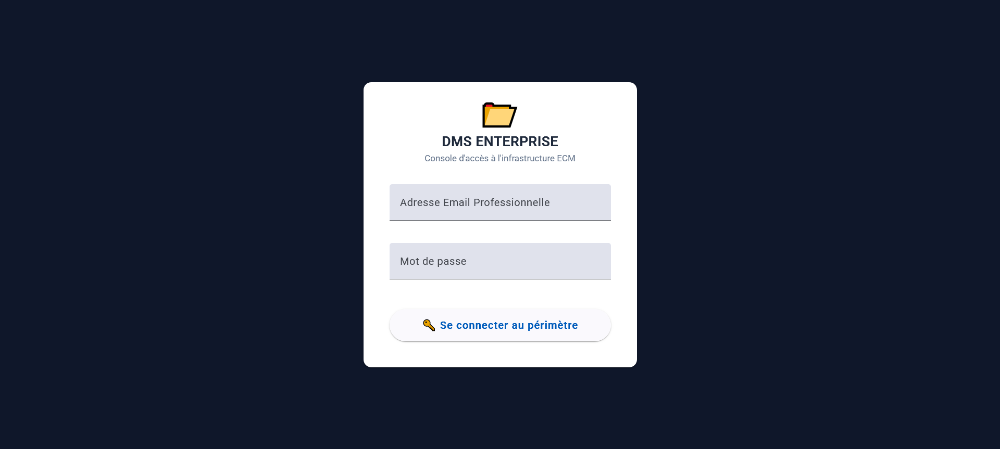
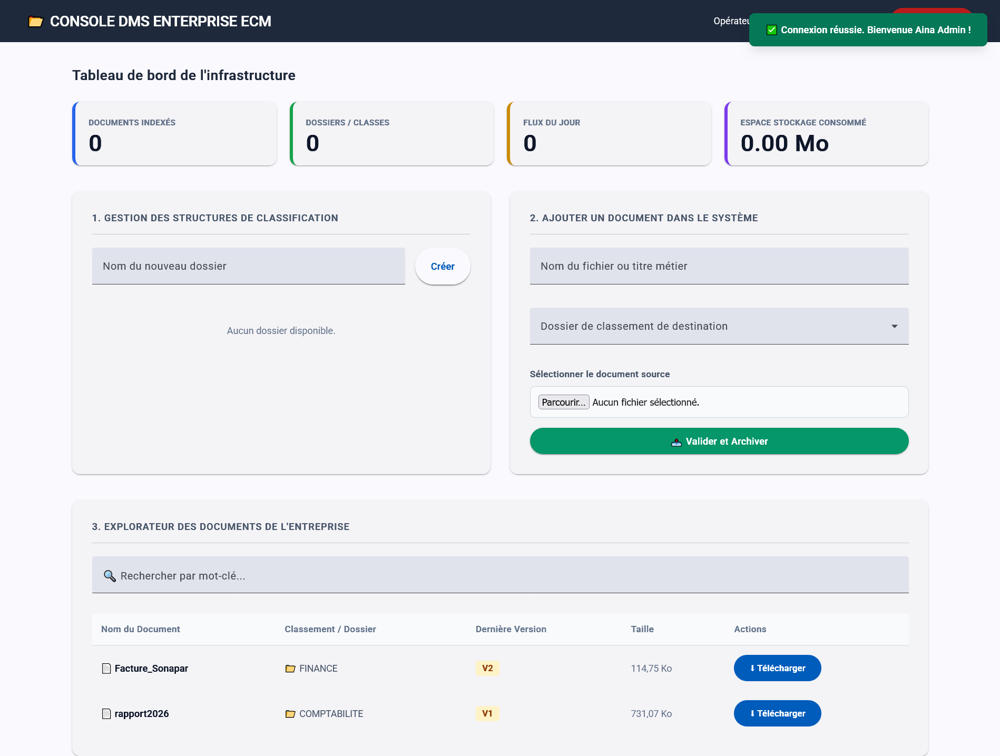
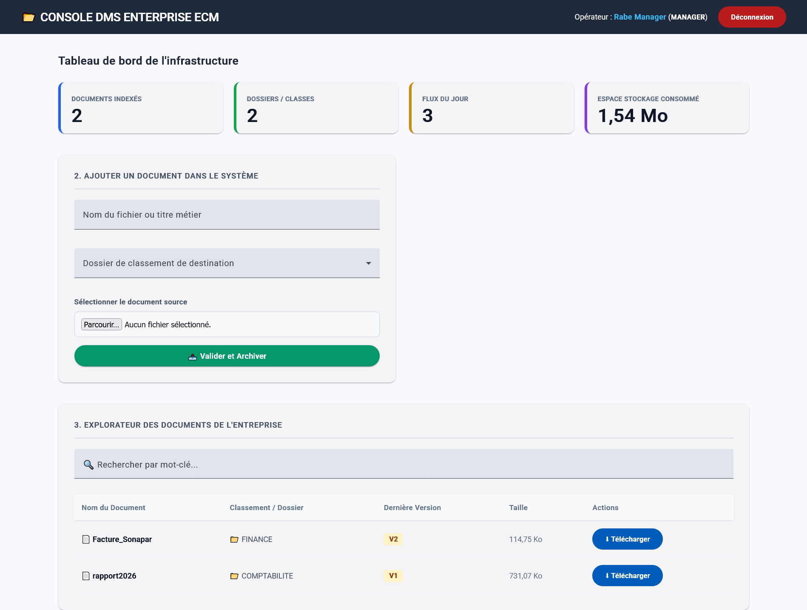
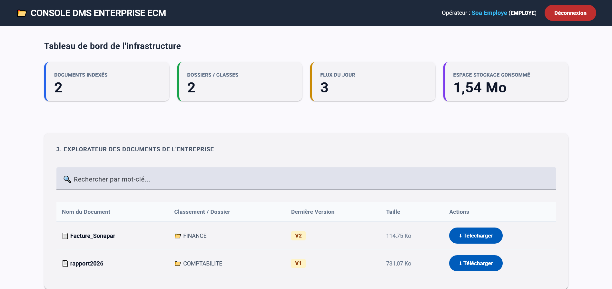
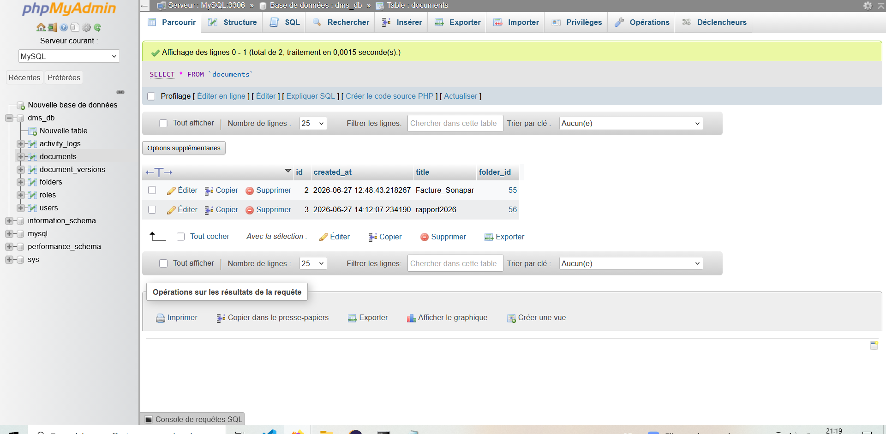

# Système de Gestion Documentaire d'Entreprise (DMS)

Ce projet consiste en la réalisation d'une application d'entreprise complète dédiée à la gestion, à l'indexation et à l'archivage sécurisé de documents physiques. L'application repose sur une architecture découplée associant une interface utilisateur moderne et un moteur de traitement de données robuste.

## Architecture Technique

L'infrastructure du système est structurée autour de technologies modernes et complémentaires :
*   **Environnement Backend** : Conçu avec Java et le framework Spring Boot, exploitant Spring Data JPA et Hibernate pour la persistance des données sous un système de gestion de base de données MySQL.
*   **Environnement Frontend** : Développé avec le framework Angular en mode composants autonomes, intégré aux éléments graphiques industriels de la bibliothèque Angular Material.

## Fonctionnalités Majeures

### 1. Authentification et Contrôle d'Accès Basé sur les Rôles
Le système intègre un périmètre de sécurité strict segmentant l'accès aux fonctionnalités selon trois profils d'utilisateurs distincts :
*   **Administrateur** : Dispose des privilèges absolus sur l'infrastructure, incluant la création des structures de classification, la suppression des index et la consultation intégrale des journaux d'audit.
*   **Manager** : Autorisé à indexer de nouveaux documents métiers et à organiser les fichiers dans les structures existantes.
*   **Employé** : Restreint à la recherche opérationnelle, à la consultation des index et au téléchargement des pièces justificatives.

### 2. Algorithme de Gestion Automatique du Versioning
Afin d'éviter la duplication inutile de lignes de données, le moteur backend intègre un algorithme d'analyse de doublons insensible à la casse. Lorsqu'un fichier portant un titre identique est téléversé dans le même dossier de destination, le système n'ajoute pas de nouvel enregistrement mais incrémente automatiquement le numéro de version du document (Version 1, Version 2, Version 3, jusqu'à Version 10) tout en préservant l'historique de stockage.

### 3. Registre Central d'Audit et Traçabilité
Chaque mouvement documentaire et chaque action effectuée par un opérateur (authentification, création de dossier, ajout de version ou suppression) fait l'objet d'une inscription obligatoire et définitive dans un journal d'audit centralisé, garantissant la conformité et la traçabilité des opérations de l'entreprise.

### 4. Moteur de Stockage Physique Local
L'archivage des fichiers s'effectue directement au sein d'un répertoire physique sécurisé configuré sur le disque local, rendant l'infrastructure logicielle totalement autonome et opérationnelle hors-ligne.

---

## Aperçu de l'Interface Utilisateur

### Écran d'Authentification Sécurisé
L'accès à l'application est protégé par une console de connexion exclusive.


### Tableau de Bord de l'Administrateur (Accès Total)
Vue d'ensemble de la console d'administration affichant l'intégralité des modules métiers et le registre d'audit.


### Console du Manager (Gestion des Importations)
Interface restreinte permettant l'indexation opérationnelle des fichiers et l'accès à l'explorateur.


### Espace de Consultation de l'Employé (Recherche et Consultation)
Interface épurée dédiée exclusivement à la recherche documentaire et au téléchargement sécurisé.

### Structure de la Base de Données Relationale (MySQL)
Vue globale des tables relationnelles gérées par Hibernate et Spring Data JPA au sein de l'environnement phpMyAdmin, illustrant la persistance des métadonnées et la traçabilité des versions.


---

## Guide d'Installation et de Déploiement Local

### Prérequis Système
*   Environnement d'exécution Java (Java Development Kit 21)
*   Outil de gestion des dépendances Node.js et gestionnaire de paquets npm
*   Serveur de base de données MySQL activé via un environnement local comme WampServer

### Déploiement du Serveur Backend
1. Naviguer dans le répertoire du code source du serveur.
2. Configurer les paramètres de connexion à la base de données au sein du fichier `application.properties`.
3. Exécuter la commande de lancement de l'application Spring Boot :
   ```bash
   ./mvnw spring-boot:run
   ```

### Déploiement de l'Interface Frontend
1. Naviguer dans le répertoire du code source de l'interface utilisateur.
2. Lancer la compilation et le serveur d'exécution local d'Angular :
   ```bash
   npm start
   ```
3. Consulter l'application finale accessible via un navigateur internet à l'adresse de diffusion locale : `http://localhost:4200`.
